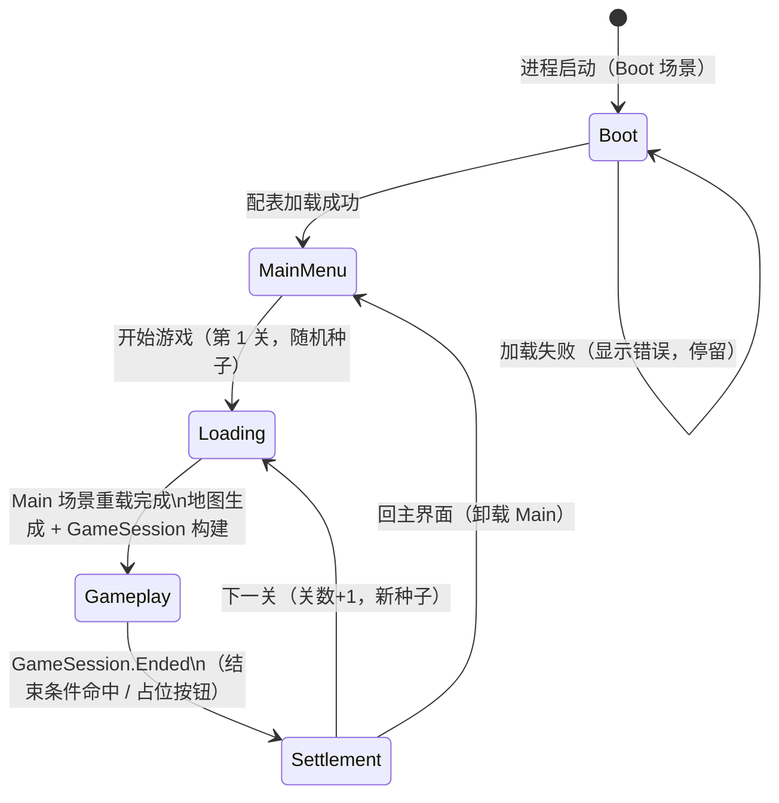

# 启动框架设计（Boot Framework）

> 本文档描述游戏的**局外流程框架**：从进程启动到「主界面 → 进关 → 局内 → 结算 → 下一关/回主界面」的完整链路。
> 与 [PROJECT_BUILD.md](PROJECT_BUILD.md) 的关系：本框架属于其 §2 架构中的 **App 应用层**，是 M0 工程骨架的核心交付物；
> 局内玩法循环（GameSession，PROJECT_BUILD §4.7）是本框架 Gameplay 状态托管的下一层，另行实现。

---

## 1. 流程总览



| 状态 | 职责 | 进入时 UI | 出口 |
|---|---|---|---|
| **Boot** | 配表加载（`UnityTableLoader.LoadFromResources`）、全局服务初始化 | LoadingPanel「初始化中…」 | 成功 → MainMenu；失败停留 + 显示错误 |
| **MainMenu** | 等待玩家操作 | MainMenuPanel | `StartGame()` → Loading；`QuitGame()` |
| **Loading** | 整体重载 Main 场景 → 地图生成（M1 接入）→ 构建 GameSession | LoadingPanel「第 N 关 加载中…」 | 完成 → Gameplay |
| **Gameplay** | 托管 GameSession 局内循环，订阅其 `Ended` 事件 | HudPanel | 会话结束 → Settlement |
| **Settlement** | 展示 `RunResult`（骨架版总分+原因；M5 扩为分数明细） | SettlementPanel | `NextRun()` → Loading；`ReturnToMainMenu()` → MainMenu |

## 2. 「关」的语义（重要约定）

- **下一关 = 换新地图（新种子）再开一局**，用 `RunContext { RunIndex, Seed }` 表达，关数无上限。
- **与 Level 表无关**：配表里的 `Level` 表是**局内 20 级进度**（解锁费用、建筑组抽取池），属于 GameSession 的领域；局外的「第 N 关」目前没有配表支撑。
- 扩展点：若后续要做有限关卡 / 每关差异化参数（地图尺寸、目标分、元素配额），新增 `Stage` 配表，在 `RunContext` 挂 `StageRow` 即可，流程状态机不用改。

## 3. 场景组织：Boot 常驻 + Main 附加

```
Boot.unity（常驻，永不卸载，Build 首场景）
├── AppRoot          → GameFlow（局外状态机）
├── MenuCamera       → 纯色背景相机（cullingMask=0，depth=-10）+ 全局唯一 AudioListener
├── UIRoot           → Canvas + UIManager + FlowUIAdapter + 四个全屏面板
└── EventSystem

Main.unity（附加加载，每关整体重载）
├── Main Camera      → depth=0（进局后盖过 MenuCamera 背景），无 AudioListener
├── Directional Light
└── GameplayRoot     → M1 起地图渲染 / 建筑白模挂这里，随场景卸载整体销毁
```

- 常驻对象放常驻场景，**不用 DontDestroyOnLoad**，层级面板里生命周期一目了然。
- 每关「整体重载 Main」而不是复用清场，天然避免跨局残留（`SceneLoader.ReloadMainAsync`）。
- 相机约定：MenuCamera 一直开着只当背景色；Main 相机 depth 更高自然盖过它，卸载 Main 后菜单背景自动露出，零切换代码。AudioListener 全局只有 MenuCamera 一个。

## 4. 代码结构与依赖方向

```
Game.UI ──────┐
Game.View ────┼──→ Game.App ──→ Game.Domain（noEngineReferences）
Game.Input ───┘        │
                       └─────→ Game.Config（配表读取，已有）
```

### App 层（[Assets/Script/App/](../Assets/Script/App/)）

| 文件 | 职责 |
|---|---|
| [GameFlow.cs](../Assets/Script/App/GameFlow.cs) | 状态机宿主（MonoBehaviour，挂 AppRoot）。持有状态表、`ChangeState`、UI 公开入口（`StartGame` / `NextRun` / `ReturnToMainMenu` / `QuitGame` / `EndCurrentRunForDebug`）、事件（`StateEntered` / `BootFailed`） |
| [GameStateId.cs](../Assets/Script/App/GameStateId.cs) / [IGameState.cs](../Assets/Script/App/IGameState.cs) | 状态枚举 + 状态接口（Enter/Exit/Tick） |
| [States/](../Assets/Script/App/States/) | 五个状态实现，各自单一职责 |
| [RunContext.cs](../Assets/Script/App/RunContext.cs) | 一关的局外参数（关数 + 种子） |
| [RunResult.cs](../Assets/Script/App/RunResult.cs) | 结算结果（骨架版；M5 扩为分数明细） |
| [GameSession.cs](../Assets/Script/App/GameSession.cs) | 局内会话**占位**，只有 `Ended` 事件；正式实现见 PROJECT_BUILD §4.7 |
| [SceneLoader.cs](../Assets/Script/App/SceneLoader.cs) | Main 场景重载/卸载协程 |

关键约定：

1. **`IGameState.Enter` 内禁止同步 `ChangeState`**（需要立即转移的开协程延迟一帧，如 BootState），保证 `StateEntered` 事件按真实顺序广播。
2. `ChangeState` 顺序：Exit 旧 → 更新 `CurrentStateId` → 广播 `StateEntered` → Enter 新。
3. UI 入口都带状态守卫（如 `NextRun` 只在 Settlement 生效），防连点/误触。

### UI 层（[Assets/Script/UI/](../Assets/Script/UI/)）

- [UIManager.cs](../Assets/Script/UI/UIManager.cs)：按类型索引 UIRoot 下所有 `UIPanel`，`ShowOnly<T>()` 互斥显示（骨架版一屏一面板；叠加弹窗需求出现时再扩面板栈）。
- [FlowUIAdapter.cs](../Assets/Script/UI/FlowUIAdapter.cs)：**流程 ↔ UI 的唯一桥接**。订阅 `StateEntered` 切面板、把按钮点击转发回 GameFlow。GameFlow 完全不知道面板类型——换 UI 实现只改这一个类。
- 四个面板（[Panels/](../Assets/Script/UI/Panels/)）都是哑视图：只有控件引用和 Set 方法，不含流程逻辑。
- **字体**：骨架用 uGUI 传统 Text（`LegacyRuntime.ttf` 动态字体走系统回退，中文可显示）。TMP 默认字体无中文字形，正式 UI 阶段再引入 TMP + 中文字体资产（届时只改面板与场景，不动流程）。

## 5. 骨架里的占位与后续接入点

| 占位 | 现状 | 接入点 |
|---|---|---|
| GameSession | 只有 `Ended` 事件 + `EndRun()` 直接给占位结果 | M2 实现核心循环后，在四个结束条件处触发 `Ended`（携真实终局结算），删除 HUD 占位按钮 |
| 地图生成 | LoadingState 里 `TODO(M1)` | 按 `CurrentRun.Seed` 生成地图 → 构建领域层 → 绑定 View，全部完成再进 Gameplay |
| HUD | 关数/种子 + 占位「结束本局」按钮 | M2 起替换为资源条/建筑组二选一/手牌/预览明细（PROJECT_BUILD §4.8） |
| 结算面板 | 总分 + 结束原因文本 | M5 终局结算实装后展示逐条分数明细（即时分/终局网络分分离） |
| RunResult | 只有 TotalScore/EndReason | 随 M5 扩为明细列表 |

## 6. asmdef 一览（本次一并落地 M0）

| asmdef | 位置 | 引用 | 说明 |
|---|---|---|---|
| Game.Domain | Script/Domain | — | `noEngineReferences: true`，暂空 |
| Game.Config | Script/Config | Domain | 既有配表代码收编入此 |
| Game.Config.Editor | Script/Config/Editor | Config | 转表菜单（Editor only） |
| Game.App | Script/App | Domain, Config | 本框架主体 |
| Game.UI | Script/UI | App, Domain, Config, UnityEngine.UI | 面板 + 桥接 |
| Game.View | Script/View | App, Domain, Config | 暂空（M1 地图渲染） |
| Game.Input | Script/Input | App, Unity.InputSystem | 暂空（M1 摆放输入） |
| Game.Tool.Editor | Tool/Editor | App, UI, Config, UnityEngine.UI | 场景生成器（Editor only） |
| Game.Tests.EditMode | Tests/EditMode | Domain, TestRunner | 冒烟测试 |

## 7. 如何运行

1. Unity 编辑器菜单 **Tools → 框架 → 生成启动场景（Boot + Main）**（生成 [Boot.unity](../Assets/Scenes/Boot.unity) / [Main.unity](../Assets/Scenes/Main.unity) 并注册 Build Settings，重跑会覆盖，有确认弹窗）；
2. 打开 Boot 场景直接 **Play**：初始化 → 主界面 →「开始游戏」→ 加载 → 局内 HUD →「结束本局（占位）」→ 结算 →「下一关」/「回主界面」，整条闭环可空转；
3. Window → General → **Test Runner** 应能看到 `EditModeSmokeTest` 并通过。

> 注意：Boot 状态会真实加载 `Resources/Tables` 配表，缺表/坏表会在启动界面直接显示错误信息（这是有意设计——配表问题越早暴露越好）。
